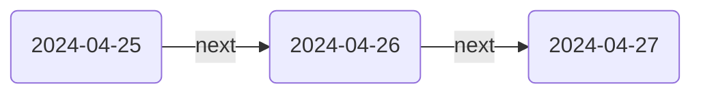

These commands let you quickly jump around your Breadcrumbs graph. For each of your [[Field Groups]], there is a command to jump to the first neighbour in that field.

> [!TIP]
> Set some hotkeys for the different directions to quickly jump around the graph ⚡️

For example, in the following chain of [[Date Notes]], you could run the `Jump to First Neighbour in group:nexts` command to jump from the current note to the next day's note

