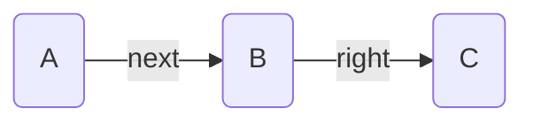

---
aliases:
  - Reference
---

This page defines various concepts used across Breadcrumbs

## Graph

Breadcrumbs uses a graph data-structure to represent the links in your notes. This is very similar to the vanilla Obsidian graph, except now, edges have _types_ to them (these are stored in the [[#Edge Attributes]]).

> [!EXAMPLE]
> A common use-case of graphs is representing personal-connections in a social network. Edge person is represented as a _node_ in the graph, and connections between people (e.g. friendship) are represented as _edges_.

[Mermaid](https://mermaid.js.org) is used to visualisation graphs in a few places across Breadcrumbs, mainly in [[Codeblocks]]. A simple example of a graph is:

## Node Attributes

Each node in the Breadcrumbs [[#Graph]] represents a note in your Obsidian vault. They have the following attributes:

- `resolved`: Whether the note is resolved or not (exists as a markdown file)
- `aliases`: Any aliases of the note, used for display purposes

## Edge Attributes

Edges in the Breadcrumbs [[#Graph]] represent links between nodes (notes). These are _similar_ to Obsidian links, but can be created using other methods as well, not just `[[wikilinks]]`. Each edge has a few attributes:

- `field`: Which [[Edge Fields|edge field]] was used
- `explicit`: Whether the edge is [[Explicit Edge Builders|explicit]] or [[Implied Edge Builders|implied]]
- `source`: If the edge is explicit, which [[Explicit Edge Builders|edge builder]] added it
- `implied_kind`: If the edge is implied, which [[Implied Edge Builders|implied rule]] added it
- `round`: If the edge is implied, which [[Implied Relation Rounds|round]] was it added in

## Edge Sorters

Various Breadcrumbs functions let you sort a list of (potentially nested) edges. The available fields to sort by include:

- `basename`: sorts by the basename of the target note
- `path`: sorts by the full path of the target note
- `field`: sorts by the [[Edge Fields|field]] of the edge
- `explicit`: sorts by the explicitness of the edge
  - Uses `source` as a tiebreaker for [[Explicit Edge Builders|explicit]] edges, and `implied_kind` for [[Implied Edge Builders|implied]] edges

There are more complex sort fields as well:

- `neighbour-field:<field>` sort by the _path_ of the first neighbour of the note in the given [[Edge Fields|edge field]].
  - Useful for sorting by the `next` neighbour.

## Traversal

A _graph traversal_ is a systematic way to visit each node in a [[#Graph]]. There are different strategies you can use, just like there are different routes you could take through a city grid. Two common strategies are:

- _Depth-first search_, which is like starting at your house and going down the first street you see, then exploring every little side street and alley off of that street before you go back and try the next street.
- _Breadth-first search_ is like checking out all the streets immediately around your house first, then moving out to the next layer of streets, and so on.

So in short, a graph traversal is a way to explore all parts of a connected structure, like a city map, in a systematic and efficient way.

Applied to Breadcrumbs, many of the [[Views]] run a traversal - starting from the currently active note - and find all paths going outwards. Often, the resulting paths are filtered, such that they meet some criteria (usually that every edge in the path has a given [[Edge Fields|field]] attribute).
