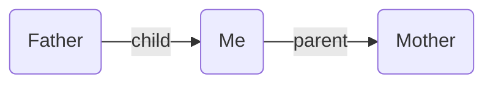

---
aliases:
  - edge fields
  - field
---

The starting point of Breadcrumbs is _fields_, which let you add _types_ to your links. For example the `[[Father]]` note could have a `child` field pointing to `[[Me]]`, and `[[Me]]` could have a `parent` field pointing to `[[Mother]]`.

**Father.md**

```md
---
child: "[[Me]]"
---
```

**Me.md**

```md
%% Works with Dataview inline fields, too %%

parent:: [[Mother]]
```



To get started, you need to tell Breadcrumbs which fields you intend to use to "type" your links. This can be done under `Settings > Edge Fields`. By default, there will be 5 starting fields: `up`, `same`, `down`, `next`, and `prev`, representing 5 different directions.

![[Edge Field Settings.png]]

The 5 default fields can take you a long way, but you can also add/remove fields as you need. For example, you can [[Personal Relationship Management|model personal relationships]] using fields like `parent`, `child`, and `sibling`. Or you can create a [[Layered Daily Notes|layered system of daily notes]] using fields like `day`, `month`, and `year`.
