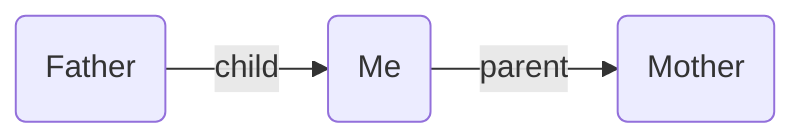

---
aliases:
  - edge fields
  - field
---

The starting point of Breadcrumbs is _fields_, which let you add _types_ to your links. For example the `[[Father]]` note could have a `child` field pointing to `[[Me]]`, and `[[Me]]` could have a `parent` field pointing to `[[Mother]]`.

To get started, you need to tell Breadcrumbs which fields you intend to use to "type" your links. This can be done under Settings > Edge Fields. By default, there will be 5 starting fields: `up`, `same`, `down`, `next`, and `prev`, representing 5 different directions. You can add and remove fields as you prefer.
