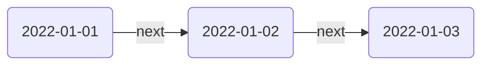

_Date Notes_ allow you to leverage your existing daily notes structure. You can enable Date Notes globally in the settings, under Date Notes. For example, Breadcrumbs can add edges from `2022-01-01` to `2022-01-02`, to `2022-01-03` using the field you specify.

Under the hood, Breadcrumbs takes the date of the current note and _adds one day_ to it. So the field you choose should reflect the "next" nature of this builder (as opposed to pointing to the date _before_ the current one).

> [!TIP]
> Refer to the Luxon documentation for the full list of date formats: <https://moment.github.io/luxon/#/parsing?id=table-of-tokens>.

## Settings

- **Enable**: Toggle Date Notes on or off.
- **Field**: Choose the field to use for the edges.
- **Date Format**: Choose the date format you use for your daily notes (e.g. `YYYY-MM-DD`).
- **Stretch to Existing**: If there is a gap from one day to another, should the next note be the unresolved one in _one day_ or should it "stretch" to the next resolved (existing) note?
