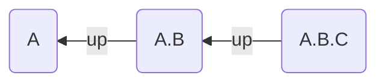

If you use the [Dendron](https://www.dendron.so/) note-taking system, Breadcrumbs can leverage the structure of your note names. For example, if you have the following notes:

- `A`
- `A.B`
- `A.B.C`

Breadcrumbs will add edges from `A.B.C` to `A.B` to `A` using the field you specify.

> [!IMPORTANT]
> Breadcrumbs always looks for the note "upwards" of the previous, so pick a field that reflects this.

## Settings

- **Enable**: Toggle Dendron notes on or off.
- **Field**: Choose the field to use for the edges.
- **Delimiter**: Choose the delimiter you use in your Dendron notes. This is generally a period (`.`), but can be anything you like.
- **Display Trimmed**: Choose to display the trimmed note name. This will remove the prefix from the note name, so `A.B.C` will be displayed as `C`.
