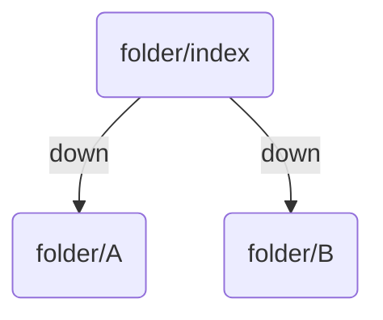
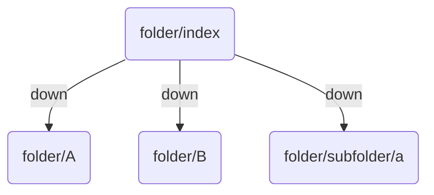

_Folder Notes_ allow you to leverage your existing folder structure. You can turn a note into a folder note by adding the following to your frontmatter:

```yaml
BC-folder-note-field: <field>
```

Where `<field>` is one of your Breadcrumbs fields. Breadcrumbs will add edges from the current note to all _other_ notes in the same folder, using the field you specify.



## `BC-folder-note-recurse`

By default, Breadcrumbs will only add edges to notes in the _immediate_ folder. If you want to add edges to notes in _all_ subfolders, you can add the `BC-folder-note-recurse` field to the frontmatter of the folder note.

```yaml
BC-folder-note-recurse: true
```



> [!IMPORTANT]
> This doesn't create _nested_ edges. It effectively flattens your folder structure into one level, so notes in subfolders will still be added as children of the _top-level_ folder note, not as children of the notes in the subfolders.
