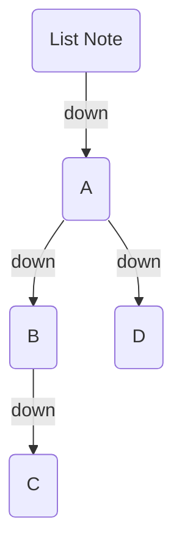
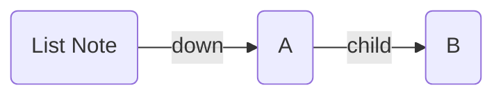
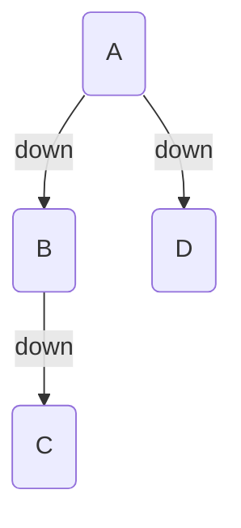
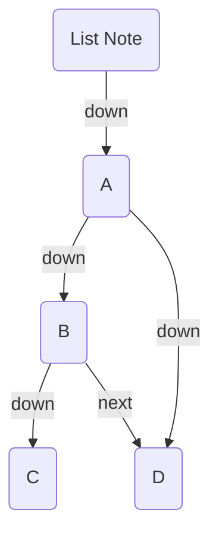

_List Notes_ allow you to leverage your existing bullet list structure. You can turn a note into a List Note by adding the following to your frontmatter:

```yaml
---
BC-list-note-field: "<field>"
---
```

Where `<field>` is one of your [[Edge Fields|edge fields]]. The structure of a List Note is as follows:

```md
---
BC-list-note-field: "down"
---

- [[A]]
  - [[B]]
    - [[C]]
  - [[D]]
```

In this example, `A` goes down to `B` and `D`, and `B`goes down to `C`:



## Field Overrides

By default, each item in the list will use the `BC-list-note-field` value to add edges. But you can override this on a per-item basis by adding the field _before_ the link.

```md
---
BC-list-note-field: "down"
---

- [[A]]
  - child [[B]]
```

In this example, `List Note` -down-> `A`, but `A` -child-> `B`.



## `BC-list-note-exclude`

By default, the list note itself links to the top-level list items. You can exclude this behaviour by adding the `BC-list-note-exclude` field to the frontmatter of the list note.

```yaml
---
BC-list-note-field: "down"
BC-list-note-exclude: true
---
```



## `BC-list-note-neighbour-field`

Normally, only the parent/child relationships are added. But you can also add edges based on the _neighbours_ of each list item. This is useful for adding sibling/next/prev relationships.

```yaml
---
BC-list-note-neighbour-field: "<field>"
---
```

Where `<field>` is one of your [[Edge Fields|edge fields]]. For example, point `down` to all child items, and point `next` to each _neighbouring_ item

```md
---
BC-list-note-field: "down"
BC-list-note-neighbour-field: "next"
---

- [[A]]
  - [[B]]
    - [[C]]
  - [[D]]
```



> [!NOTE]
> The layout of the graph kind of obscures it, but `B` and `D` are on the same level here

## Settings

- **Default Neighbour Field**: Choose a default [[Edge Fields|field]] to use for the neighbour relationships. This is useful if you have a _lot_ of list notes, and don't want to add the `BC-list-note-neighbour-field` to each one.
