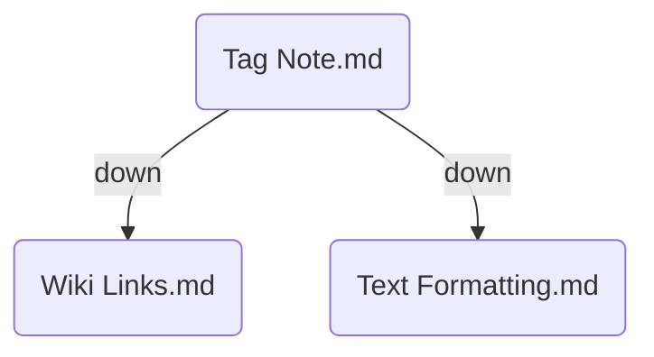

_Tag Notes_ allow you to leverage your existing tag structure. You can turn a note into a tag note by adding the following to your frontmatter:

```yaml
---
BC-tag-note-tag: "#tag"
BC-tag-note-field: "<field>"
---
```

Where `<field>` is one of your [[Edge Fields|edge fields]]. This will tell Breadcrumbs to find all notes with the tag `#tag`, and add edges from the current note to those tagged notes using the field you specify.

> [!NOTE]
> You don't _have to_ add the leading `#`, Breadcrumbs will handle either case

For example, point `down` to all notes with the #markdown tag:

```yaml
---
BC-tag-note-field: "down"
BC-tag-note-tag: "#markdown"
---
```



## `BC-tag-note-exact`

If you want to only add edges to notes that _exactly_ match the tag, you can add the `BC-tag-note-exact` field to the frontmatter of the tag note.

```yaml
---
BC-tag-note-exact: true
BC-tag-note-tag: "#markdown"
---
```

If you don't add this field, Breadcrumbs will add edges to all notes that _contain_ the tag. e.g. `#markdown/links` contains `#markdown`.
