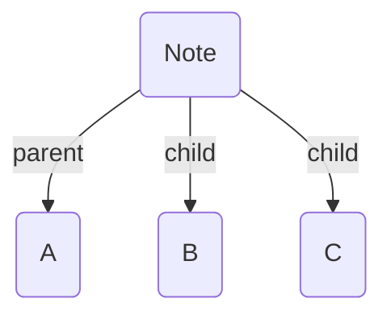

_Typed links_ are the most basic, manual way to add edges to the graph. They can be added in two ways.

## Frontmatter Links

In the YAML frontmatter of your note, you can add key/value pairs indicating a directed link to another note. The keys are your [[Edge Fields|edge fields]], while the values are links to different notes in your vault

```yaml
---
parent: "[[A]]"
child: ["[[B]]", "[[C]]"]
---
```

This tells Breadcrumbs that the `parent` of the current note is "A", and that its two `children` are "B" and "C".



## Dataview Links

If you have the [Dataview](https://github.com/blacksmithgu/obsidian-dataview) plugin enabled, you can use their format of metadata as well. In the _content_ of a note:

```md
parent:: [[A]]
child:: [[B]], [[C]]
```

This creates the same structure as the [[Typed Links#Frontmatter Links|frontmatter links]] method above.

> [!TIP]
> Use the [[Edge Field Suggestor]] to speed up adding Dataview typed-links

### Markdown Links

If you have Dataview enabled, Breadcrumbs will automatically detect and add edges from _markdown links_. These take the following format:

```md
field:: [note name](path/to/note.md)
```
