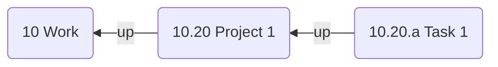

If you use the [Johnny Decimal](https://johnnydecimal.com/) note-taking system, Breadcrumbs can leverage the structure of your note names. For example, if you have the following notes:

- `10 Work`
- `10.20 Project A`
- `10.20.a Task 1`

Breadcrumbs will add edges from `10.20.a Task 1` to `10.20 Project A` to `10 Work` using the field you specify.

## Settings

- **Enable**: Toggle Johnny Decimal notes on or off.
- **Field**: Choose the field to use for the edges.
- **Delimiter**: Choose the delimiter you use in your Johnny Decimal notes. This is generally a period (`.`), but can be anything you like.
