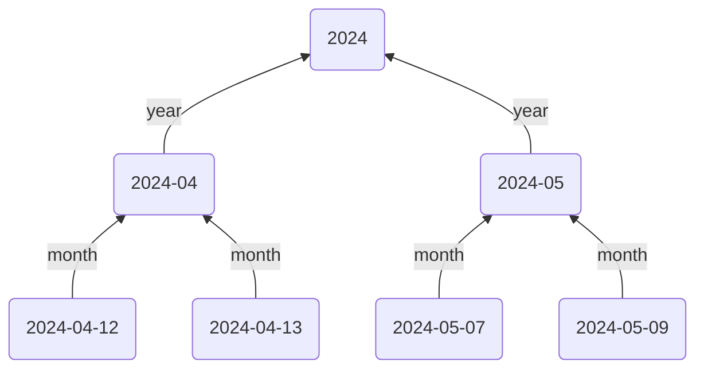

This guide will show you how to create a layered hierarchy of dates leveraging your Daily Note structure:

%% TODO: Add more content between these two paragraphs, so that the og display text doesn't have mermaid code in it %%



There are various ways this structure can be achieved. The method in this guide will use Templates with [[Typed Links]] in them to point `up` to the Monthly and Yearly Notes. Then, using Breadcrumbs' [[Date Notes]] feature (_different from the core Daily Notes plugin_), we'll point each Daily Note to the note following it (`yesterday/tomorrow`).

> [!NOTE]
> The `yesterday/tomorrow` edges aren't shown in the Mermaid graph, as it complicates the layout. But the idea is to use the `up/down` directions to go from day to month to year, and the `previous/next` directions to move between Daily Notes in chronological order.

## Steps

### 1. Setup up Your Hierarchies

We'll use some more specific hierarchy fields than the default `up`, `down`, `same`...

For Daily Notes, add the following hierarchy:

```yaml
up: month
down: days
next: tomorrow
prev: yesterday
```

For Monthly Notes, add this hierarchy:

```yaml
up: year
down: months
next: next-month
prev: prev-month
```

### 2. Daily Note Template

To begin, we'll create a new daily note template (or add to your existing one). Each daily note will point `up` to the month it's in - adjusting the date format to your preference.

```md
---
month: '[[<% tp.date.now("YYYY-MM") %>]]'
---

## Tasks

- [ ] 
```

> [!NOTE]
> Don't worry about the `tomorrow` field just yet, we'll use that later.

### 3. Monthly Note Template

Similarly, create a Monthly Note template with the following:

~~~md
---
year: '[[<% tp.date.now("YYYY") %>]]'
next-month: '[[<% tp.date.now("YYYY-MM", "P1M") %>]]'
---

## Daily Notes

```breadcrumbs
type: tree
dirs: down
```
~~~

Now each Monthly Note will point `up` to the corresponding Yearly Note, and `next` to the month after it. A [[Codeblocks|codeblock tree]] lists all daily notes from the current month.

> [!TIP]
> We don't need to add `next-month` _and_ `prev-month`, since Breadcrumbs can infer that using the [[Other Implied Relations#Opposite Direction|opposite direction implied relation]].

### 4. Date Notes

[[Date Notes]] use the date format of your existing Daily Notes to add edges between them in chronological order. To enable this:

1. Go to Breadcrumbs Settings
2. Toggle Date Notes on using `Edge Source > Date Notes > Enable`
3. Change the Default Field setting to `tomorrow`
4. Enter your preferred date format (in [Luxon notation](https://moment.github.io/luxon/#/parsing?id=table-of-tokens))
5. Optionally toggle "Stretch to Existing", depending on what behaviour you want if there are missing Daily Notes

### 5. Leverage

You're all set up! Now each Daily Note will point upwards to the month and `tomorrow` to the following day, and Monthly Notes point up the the year.

## Extras/Advanced Usage

### `day/events` Hierarchy

Add an additional hierarchy _below_ Daily Notes, to capture events that happened on a particular day:

```yaml
up: day
down: events
```

For example, in a university lecture note, you can point `up` to the day it happened:

```md
---
day: [[2024-04-13]]
---

## Calculus

...
```

Then when viewing the Daily Note `[[2024-04-13]]`, you'll see all the events that happened on that day in the [[Matrix View]] or [[Tree View]] pointing `down`.

### Moving around between Daily Notes and other Layers

Assign hotkeys to the [[Jump to First Neighbour]] command to quickly move back and forth between `yesterday` and `tomorrow`.
