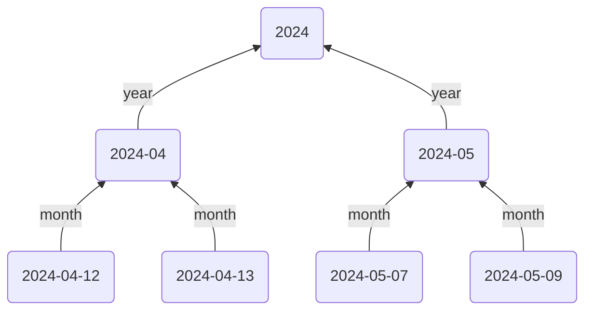
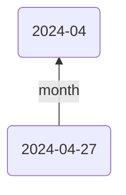
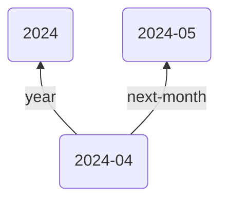
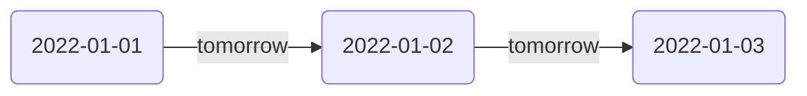

This guide will show you how to create a layered hierarchy of Daily, Monthly, and Yearly Notes. The end result will allow you to quickly move through your Daily Notes, and see them in the context of the month and year they belong to.



There are various ways this structure can be achieved. The method in this guide will use the [Templater plugin](https://silentvoid13.github.io/Templater/) to add templates with [[Typed Links]] in them to point `up` to the Monthly and Yearly Notes. Then, using Breadcrumbs' [[Date Notes]] feature (_different from the core Daily Notes plugin_), we'll point each Daily Note to the note following it (`yesterday/tomorrow`).

> [!NOTE]
> The `yesterday/tomorrow` edges aren't shown in the Mermaid graph, as it complicates the layout. But the idea is to use the `up/down` directions to go from day to month to year, and the `previous/next` directions to move between Daily Notes in chronological order.

## Steps

### 1. Setup up Your Fields

We'll use some more specific fields than the default `up`, `down`, `same`... For Daily Notes, add the following fields. This can be done in your [[Edge Fields]] settings, under `Settings > Edge Fields`.

- `month`: Points up from day to month
- `days`: Points down from month to day
- `tomorrow`: Point "right" from current day to next day
- `yesterday`: Points "left" from current day to previous day

And for Monthly Notes, add these fields:

- `year`: Points up from month to year
- `months`: Points down from year to month
- `next-month`: Points "right" from current month to next month
- `prev-month`: Points "left" from current month to previous month

The end result should look like this:

![[Layered Daily Notes EdgeFieldSettings.png]]

### 2. Daily Note Template

Next, we'll create a new daily note template (or add to your existing one). Each daily note will point `up` to the month it's in - adjusting the date format to your preference.

**Templates/Daily Note.md**:

```md
---
month: "[[<% tp.date.now("YYYY-MM") %>]]"
---

## Tasks

- [ ]
```



> [!NOTE]
> Don't worry about the `tomorrow` field just yet, we'll use that later.

### 3. Monthly Note Template

Similarly, create a Monthly Note template with the following, pointing up to the corresponding year, and "right" to the next month:

**Templates/Monthly Note.md**:

````md
---
year: "[[<% tp.date.now("YYYY") %>]]"
next-month: "[[<% tp.date.now("YYYY-MM", "P1M") %>]]"
---

## Daily Notes

```breadcrumbs
type: tree
fields: [days]
```
````

Now each Monthly Note will point `up` to the corresponding Yearly Note, and `next` to the month after it. A [[Codeblocks|codeblock tree]] lists all daily notes from the current month.



### 4. Date Notes

[[Date Notes]] use the date format of your existing Daily Notes to add edges between them in chronological order. To enable this:

1. Go to Breadcrumbs Settings
2. Toggle Date Notes on using `Edge Source > Date Notes > Enable`
3. Change the Default Field setting to `tomorrow`
4. Enter your preferred date format (in [Luxon notation](https://moment.github.io/luxon/#/parsing?id=table-of-tokens))
5. Optionally toggle "Stretch to Existing", depending on what behaviour you want if there are missing Daily Notes

![[Layered Daily Notes Date Note Settings.png]]

Now edge of your Daily Notes should automatically point `tomorrow` to the following day's note.



### 5. Implied Relationships

In the previous steps, we used the `month` field in the Daily Note template, but not the `months` field, which should point back down from month to day. Similarly, we only added the `next-month` field to the Monthly Note template, but not the `prev-month` field. And lastly, we used the `tomorrow` field for Date Notes, but didn't specify the `yesterday` field anywhere. This is because Breadcrumbs can _infer_ these relationships - they're "opposites", in a sense.

To set this up, open `Settings > Implied Relations > Transitive`, and add the following [[Transitive Implied Relations]]:

- `[month] <- days`

![[transitive (month) <- days.png]]

- `[tomorrow] <- yesterday`

![[transitive (tomorrow) <- yesterday.png]]

- `[next-month] <- prev-month`

![[transitive (next-month) <- prev-month.png]]

Now, when you [[Rebuild Graph|rebuild the graph]], Breadcrumbs will apply these rules to your _explicit_ edges, by adding the **implied** edges above. It "fills in the opposite direction".

### 5. Leverage

You're all set up! Now each Daily Note will point upwards to the month and `tomorrow` to the following day, and Monthly Notes point up the the year.

## Extras/Advanced Usage

### `day/events` Fields

Add some additional fields "below" the Daily Note fields, to capture events that happened on a particular day:

- `day`: Point up to the day something happened
- `events`: Point down from a particular day to an event that happened

For example, in a university lecture note, you can point up to the `day` it happened:

```md
---
day: [[2024-04-13]]
---

## Calculus

...
```

Then when viewing the Daily Note `[[2024-04-13]]`, you'll see all the events that happened on that day in the [[Matrix View]] or [[Tree View]] pointing down with the `events` field.

### Moving around between Daily Notes and other Layers

Assign hotkeys to the [[Jump to First Neighbour]] command to quickly move back and forth between `yesterday` and `tomorrow`.
