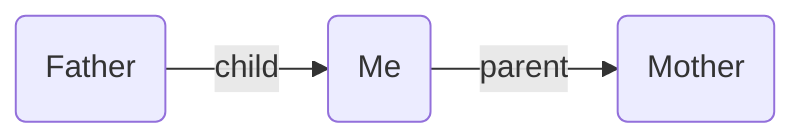

The starting point of Breadcrumbs is the hierarchy system, which determine the _directed fields_ you'll use to structure your notes. You can have as many hierarchies as you like, and they'll all run separately from each other. A basic hierarchy could be:

```
up: parent
down: child
same: sibling
prev: before
next: after
```

On the left are the unchangeable directions, and on the right are the fields you'll use to structure your notes. You can change the fields to whatever you like, but the directions are fixed.

Using these _fields_, you can now start adding edges to your Breadcrumbs graph. For example the `[[Father]]` note could have a `child` field pointing to `[[Me]]`, and `[[Me]]` could have a `parent` field pointing to `[[Mother]]`.


