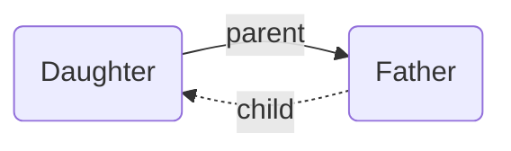

---
aliases:
  - implied
---

By adding edges to the Breadcrumbs graph, you've created various [[Explicit Edge Builders|explicit]] relationships: "Note A is the _parent_ of note B", or "note C has 3 _children_: D, E, and F". But you've also created some _implied_ relationships. For example, if A is the _parent_ of B, then it's _implied_ that B is the **child** of A!

## Rule Kinds

- [[Transitive Implied Relations]]
	- [[Implied Relation Rounds]]
