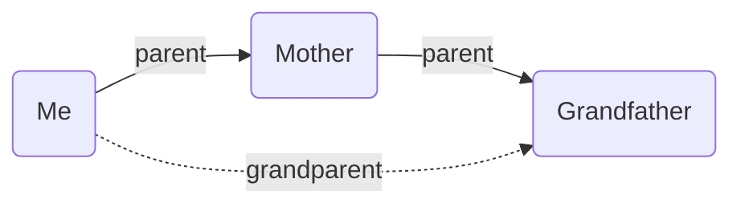
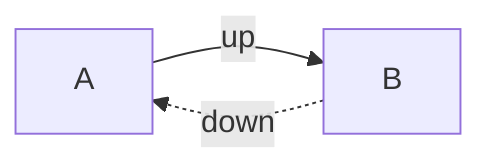
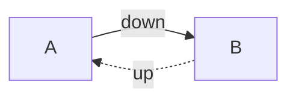

This category of implied relations can be thought of as a _chain_ of fields which collapse down to one field. For example, if A is the _parent_ of B, and B is the _parent_ of C, then it's _implied_ that A is the **grandparent** of C. This is a _transitive_ implied relation. Or, in a more general syntax, `[parent, parent] -> grandparent` (a chain of two `parent` fields collapses down to one `grandparent` field between the start and end nodes).

## Options

- **Edge Chain**: The chain of fields required for the rule to match
- **Closing Field**: Once a match is found, which field closes the chain off
- **Close Reversed**: Whether the close the chain from start to finish, or vice versa
- **Rounds**: How many [[Implied Relation Rounds|rounds]] to run the rule for
- **Name (optional)**: Give a label to the rule. By default, the `[field] -> close` syntax will be used.

## Examples

There are many different rules you can build with this syntax

### Opposite Direction

If you have to fields `up` and `down`, you can make them semantically "opposite" of one another with the following two rules (note how this rule requires the "Close Reversed" option toggled on, so that the end node points _back_ to the start node):

- `[up] <- down`

- `[down] <- up`

### Same Sibling is Sibling

If A and B both share the same _sibling_, mark them as **siblings** as well.

`[same, same] -> same`

### Siblings Parent is Parent

If A and B are _siblings_, then make A's **parent** B's **parent** as well.

`[same, up] -> up`

### Parents Sibling is Parent

If A's _parent_ is B, and B is the _sibling_ of C, then make C the **parent** of A.

`[up, same] -> up`

### Parents Child is Sibling

If A and B both have the same _parent_, mark them as **siblings**.

`[up, down] -> same`

### Cousin is Sibling

If A and B are _cousins_, mark them as **siblings**.

`[up, same, down] -> same`
