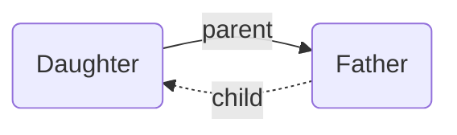

By adding edges to the Breadcrumbs graph, you've created various explicit relationships: "Note A is the _parent_ of note B", or "note C has 3 _children_: D, E, and F". But you've also created some _implied_ relationships. For example, if A is the _parent_ of B, then it's _implied_ that B is the **child** of A! This _kind_ of implied relationship is called the "opposite direction" implied relation.

There are many other kinds, including "If A and B both have the same _parent_, then they must be **siblings**". Breadcrumbs automatically detects, and adds these implied relationships to the graph. Each kind of implied relationship is completely _optional_, and can be toggled on a hierarchy-level in the settings.

- [[Transitive Implied Relations]]
- [[Other Implied Relations]]
- [[Implied Relation Rounds]]
