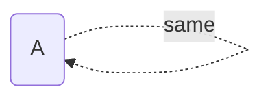
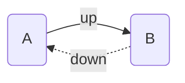

Implied relations other than [[Transitive Implied Relations]]

## Self is Sibling

This implied relation makes every note its own sibling. This is useful for always showing the current note in the various visualisations.

## Opposite Direction

If A is the _parent_ of B, then it's _implied_ that B is the **child** of A.

The mapping of opposite directions is as follows:

- `up` -> `down`
- `down` -> `up`
- `same` -> `same`
- `prev` -> `next`
- `next` -> `prev`
