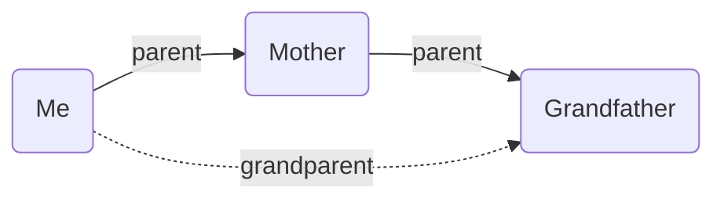

This category of implied relations can be thought of as a _chain_ of fields which collapse down to one field. For example, if A is the _parent_ of B, and B is the _parent_ of C, then it's _implied_ that A is the **grandparent** of C. This is a _transitive_ implied relation. Or, in a more general syntax, `[parent, parent] -> grandparent` (a chain of two `parent` fields collapses down to one `grandparent` field between the start and end nodes).

## Same Sibling is Sibling

If A and B both share the same _sibling_, mark them as **siblings** as well.

`[same, same] -> same`

## Siblings Parent is Parent

If A and B are _siblings_, then make A's **parent** B's **parent** as well.

`[same, up] -> up`

## Parents Sibling is Parent

If A's _parent_ is B, and B is the _sibling_ of C, then make C the **parent** of A.

`[up, same] -> up`

## Parents Child is Sibling

If A and B both have the same _parent_, mark them as **siblings**.

`[up, down] -> same`

## Cousin is Sibling

If A and B are _cousins_, mark them as **siblings**.

`[up, same, down] -> same`

## Custom Transitive Relations

Using this format of `[chain] -> closing-field`, you can create fully customised transitive relations. For example, if you have a `grandparent` field, you could add the following:

`[parent, parent] -> grandparent`

Or if you have a `sibling-in-law` field, you could add the following:

`[spouse, sibling] -> sibling-in-law`

The crucial difference between these and the built-in transitive relations are that the custom ones can use fields from _any_ hierarchy! As with regular implied relations, you can choose how many _rounds_ to run these for.
