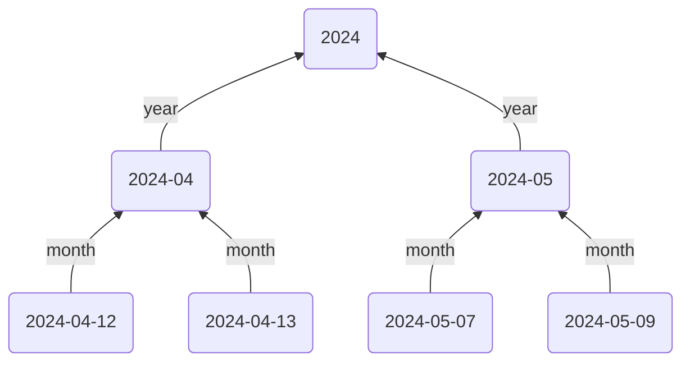

This guide will show you how to create a layered hierarchy of dates leveraging your Daily Note structure:



There are various ways this structure can be achieved. The method in this guide will use the [Templater plugin](https://github.com/SilentVoid13/Templater) with Breadcrumbs [[Typed Links]] in them to point `up` from Daily Note to Monthly Note, and from Monthly to Yearly Notes.

## Steps

### 1. Setup up Your Hierarchies

We'll use some more specific hierarchy fields than the default `up`, `down`, `same`...

For Daily Notes, add the following hierarchy:

```yaml
up: month
down: days
next: tomorrow
prev: yesterday
```

For Monthly Notes, add this hierarchy:

```yaml
up: year
down: months
next: next-month
prev: prev-month
```

### 2. Daily Note Template

Now to use these fields, let's create a Daily Note template (or add to your existing one). Each Daily Note will point `up` to the month it's in.

```md
---
month: '[[<% tp.date.now("YYYY-MM") %>]]'
---

## Tasks

- [ ] 
```

> [!NOTE]
> Don't worry about the `tomorrow` field for now, we'll use that later.

For the Monthly Note template, add the following:

~~~md
---
year: '[[<% tp.date.now("YYYY") %>]]'
---

## Daily Notes

```breadcrumbs
type: tree
dirs: down
```
~~~

Here we point `up` to the Yearly Note, and create a [[Codeblocks|codeblock tree]] to list out all the daily notes in this month.
### 5. Extras/Advanced Usage

```yaml
up: day
down: event
```

---

prev/next
