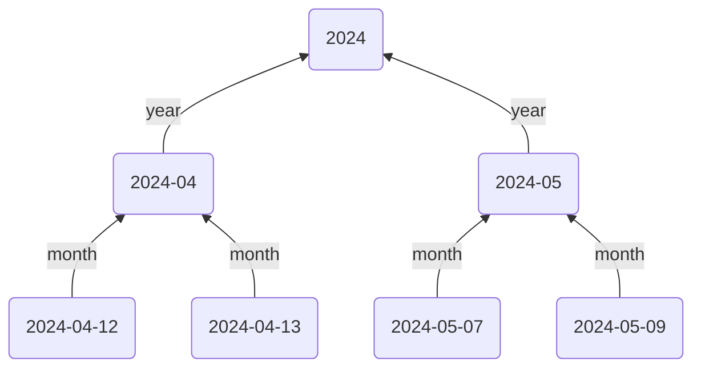

This guide will show you how to create a layered hierarchy of dates leveraging your Daily Note structure:



There are various ways this structure can be achieved. The method in this guide will use Templates with [[Typed Links]] in them to point `up` to the Monthly Notes, and [[Regex Notes]] to

## Steps

### 1. Setup up Your Hierarchies

We'll use some more specific hierarchy fields than the default `up`, `down`, `same`...

For Daily Notes, add the following hierarchy:

```yaml
up: month
down: days
next: tomorrow
prev: yesterday
```

For Monthly Notes, add this hierarchy:

```yaml
up: year
down: months
next: next-month
prev: prev-month
```

### 2. Daily Note Template

To begin, we'll create a new daily note template (or add to your existing one). Each daily note will point `up` to the month it's in, and `next` to tomorrow's daily note

```md
---
month: '[[<% tp.date.now("YYYY") %>]]'
tomorrow: '[[<% tp.date.now("YYYY-MM", "P1M") %>]]'
---

## Tasks

- [ ] 
```

### 5. Extras/Advanced Usage

```yaml
up: day
down: event
```

---
prev/next